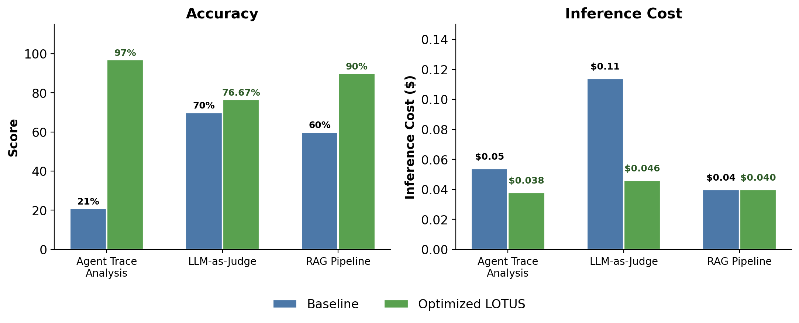
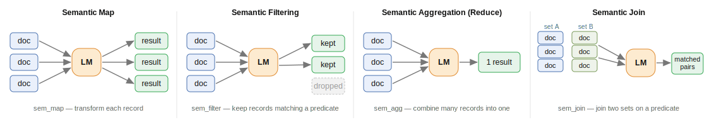

<div align="center">


# LOTUS: Optimized Agentic and LLM Bulk Processing

**Bulk process your datasets with agents and LLMs at scale, with higher accuracy and lower cost.**

*From Stanford University and UC Berkeley*

<!--- BADGES: START --->
[][#pypi-package]
[][#pypi-package]
[][#arxiv-paper-package]
[](https://lotus-ai.readthedocs.io/en/latest/?badge=latest)
[][#discord]
[](https://colab.research.google.com/drive/1mP65YHHdD6mnZmC5-Uqm2uCXJ4-Kbkhu?usp=sharing)
<!--- BADGES: END --->

[**What is LOTUS?**](#what-is-lotus) • [**Install**](#installation) • [**Quickstart**](#quickstart) • [**Semantic Operators**](#what-are-semantic-operators) • [**Community**](#community) • [**Docs**](https://lotus-ai.readthedocs.io/en/latest/) • [**Cite**](#references)

</div>

---

## What is LOTUS?

LOTUS makes **agentic and LLM bulk processing** fast, easy, and robust. It introduces and optimizes
[**semantic operators**](https://arxiv.org/abs/2407.11418) (e.g., LLM-based `map`,
`reduce`, `filter` primitives) to let you process your large datasets with LLMs and natural language instructions. LOTUS **optimizes** these operations to help you get **higher accuracy and lower cost**.

**What you can build:**

- **Agentic code processing** — run a tool-using agent (with a sandboxed Python REPL) over
  every file, document, or record, then reduce to one answer (codebase analysis, security
  sweeps, migrations).
- **Deep research & synthesis** — fan out over a corpus, extract, and synthesize.
- **Agent-trace failure analysis** — mine large volumes of agent logs for failure modes.
- **Document extraction & unstructured analysis** — structured fields and insights from text.
- **LLM-judge evals & RAG** — declarative pipelines that the engine optimizes for you.

LOTUS stands for **L**LMs **O**ver **T**ext, **U**nstructured and **S**tructured Data.

## Installation

```bash
pip install lotus-ai
```

Or with [uv](https://docs.astral.sh/uv/): `uv add lotus-ai`. For the latest features, install
from source: `pip install git+https://github.com/lotus-data/lotus.git@main`.

See the [docs](https://lotus-ai.readthedocs.io/en/latest/installation.html) for more.

## Quickstart

Give LOTUS a **corpus** and a **task**. It shards the corpus, spawns an agent per shard
**in parallel** (each with a sandboxed Python REPL for exact computation), and reduces the
per-shard findings into one answer. The example below is fully self-contained — set your
API key, paste, and run.

```python
import lotus
from lotus.models import LM
from lotus.tools import PythonREPLTool

# Configure the LM — export your API key first (e.g. export OPENAI_API_KEY=sk-...)
lotus.settings.configure(lm=LM(model="gpt-5", reasoning_effort="low"))

# A corpus can be inline documents, a DataFrame, files, or one large text.
# Here: a few small functions, some of them subtly buggy.
snippets = [
    "def average(nums): return sum(nums) / (len(nums) - 1)",
    "def word_count(s): return len(s.split())",
    "def percent(part, whole): return part / whole",
    "def reverse(s): return s[::-1]",
]
corpus = lotus.Corpus.from_documents(snippets)

# Each agent actually *runs* its function in a sandboxed REPL to find bugs —
# then LOTUS reduces the per-function results into one report.
result = corpus.agent(
    task="Test each function on example inputs and report which ones are buggy, "
         "with a counterexample for each bug.",
    ops=["map", "reduce"],       # compose agentic ops: map, filter, reduce
    tools=[PythonREPLTool()],
)

print(result.output)   # the reduced bug report
```

See the [Agentic Map-Reduce docs](https://lotus-ai.readthedocs.io/en/latest/agentic_map_reduce.html)
and [`examples/agentic_map_reduce/`](examples/agentic_map_reduce) for more.

## How it works

You express *what* you want over a dataset using high-level **semantic operators** (i.e., LLM-based map, reduce, filter); LOTUS' **optimizer** decides *how* to run it — batching calls, applying model
cascades and proxies, and lazily planning the whole pipeline — for higher accuracy at lower
cost.

<div align="center">


</div>

**The Results**: Across diverse tasks, LOTUS' optimized pipelines match or exceed the accuracy of
high-quality baselines while running substantially faster and cheaper:

<div align="center">



</div>

## What are Semantic Operators

LOTUS introduced and optimizes [semantic operators](https://arxiv.org/abs/2407.11418).
Each operator implements an LLM-based transformation over your dataset, which you specify
with a natural language instruction, and the operations can be transparently optimized.
Here are a few examples:

<div align="center">



</div>

LOTUS supports **two classes of semantic operators**, so you can match the execution style to the task:

- **Agentic operators** run tool-using agents over a corpus (`corpus.agent(ops=["map", "filter", "reduce"], ...)`). They shine on **complex or ambiguous tasks that benefit from multiple steps and tool calls** — running code to compute exact values, parsing files, sweeping a codebase, or filtering with non-trivial judgment. See the runnable [`examples/agentic_map_reduce/`](examples/agentic_map_reduce) (an expense-report roll-up and a codebase sweep).

- **LLM operators** (`sem_map`, `sem_filter`, `sem_agg`, `sem_join`, `sem_extract`, …) invoke **far fewer model calls per record** and are ideal for **well-defined tasks** — LLM-as-judge evaluations, document and attribute extraction, and unstructured data analysis at scale.

See the
[documentation](https://lotus-ai.readthedocs.io/en/latest/) and the
[intro Colab tutorial](https://colab.research.google.com/drive/1mP65YHHdD6mnZmC5-Uqm2uCXJ4-Kbkhu?usp=sharing) for more on semantic operators that LOTUS serves.

## Docs

For more, you can checkout the official [docs](https://lotus-ai.readthedocs.io/en/latest/), which includes more on: 

- [Installation](https://lotus-ai.readthedocs.io/en/latest/installation.html) & [Core Concepts](https://lotus-ai.readthedocs.io/en/latest/core_concepts.html)
- [Agentic Semantic Operators](https://lotus-ai.readthedocs.io/en/latest/agentic_operators.html) — the `Corpus`, agentic map-reduce and filter, tools/REPL, and worked [examples](https://lotus-ai.readthedocs.io/en/latest/agentic_examples.html)
- [LLM Semantic Operators](https://lotus-ai.readthedocs.io/en/latest/sem_map.html) — `sem_map`, `sem_filter`, `sem_agg`, `sem_join`, and more
- [Optimizations](https://lotus-ai.readthedocs.io/en/latest/lazyframe.html) — the query engine, cascades, and lazy execution
- [Supported Models](https://lotus-ai.readthedocs.io/en/latest/llm.html) — LMs, retrievers, rerankers (any [LiteLLM](https://litellm.vercel.app) provider)

## Community
Join us on [Discord][#discord] to ask questions and share what you're building.

Check out these awesome projects that are building with LOTUS:

- **[MAP: Measuring Agents in Production](https://arxiv.org/abs/2512.04123)** — a large-scale
  empirical study of deployed LLM agent systems across many domains (UC Berkeley, Intesa Sanpaolo, UIUC, Stanford, IBM Research; ICML 2026).
- **[VibeCheck](https://github.com/lisadunlap/VibeCheck)** — discovers and quantifies
  qualitative differences between LLMs (UC Berkeley; ICLR 2025).
- **[DeepScholar](https://deep-scholar.vercel.app/)** — generative research synthesis over
  the scientific literature, competitive with OAI DR (Stanford, UC Berkeley).

Using LOTUS in your project? Reach out to @semantic_operators on discord if you'd like it featured.

## Contributing

We welcome all contributions! Read the [Contributing Guide](CONTRIBUTING.md). For trouble-shooting or feature requests, open an issue and
we'll get to it promptly.

## References

Follow [@lianapatel_](https://x.com/lianapatel_) on X for updates. If you find LOTUS or
semantic operators useful, please cite:

```bibtex
@article{patel2025semanticoptimization,
    title = {Semantic Operators and Their Optimization: Enabling LLM-Based Data Processing with Accuracy Guarantees in LOTUS},
    author = {Patel, Liana and Jha, Siddharth and Pan, Melissa and Gupta, Harshit and Asawa, Parth and Guestrin, Carlos and Zaharia, Matei},
    year = {2025},
    journal = {Proc. VLDB Endow.},
    url = {https://doi.org/10.14778/3749646.3749685},
}
@article{patel2024semanticoperators,
    title={Semantic Operators: A Declarative Model for Rich, AI-based Analytics Over Text Data},
    author={Liana Patel and Siddharth Jha and Parth Asawa and Melissa Pan and Carlos Guestrin and Matei Zaharia},
    year={2024},
    eprint={2407.11418},
    url={https://arxiv.org/abs/2407.11418},
}
@article{patel2026ainative,
    title = {Towards AI-Native Data Systems with the Semantic Operator Model and LOTUS},
    author = {Patel, Liana and Guestrin, Carlos and Zaharia, Matei},
    year = {2026},
    journal = {IEEE Data Engineering Bulletin},
    url = {http://sites.computer.org/debull/A26mar/A26MAR-CD.pdf#page=61},
}
```

[#arxiv-paper-package]: https://arxiv.org/abs/2407.11418
[#pypi-package]: https://pypi.org/project/lotus-ai/
[#discord]: https://discord.gg/ZWQBurm5bt
